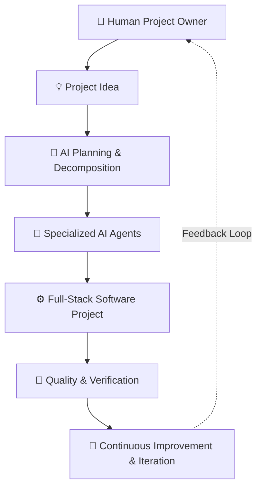
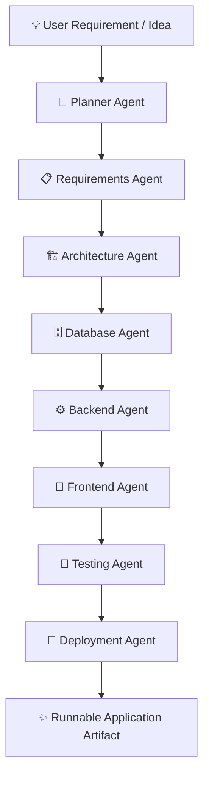
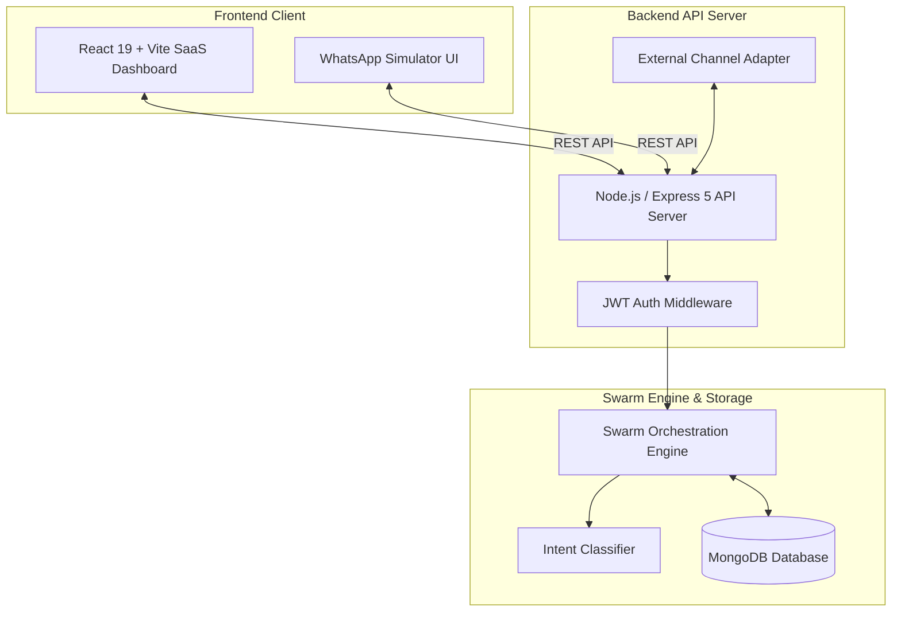

# SwarmOS

> **AI Agent Teams for Building Software from Ideas to Deployment.**

SwarmOS is an AI-powered multi-agent software development platform that coordinates specialized AI agents to transform software ideas into structured, buildable, and continuously evolving projects.

Designed around the paradigm of a collaborative **AI engineering team** rather than a single chatbot assistant, SwarmOS coordinates specialized roles across planning, requirements, architecture, database design, backend engineering, frontend generation, testing, and deployment.

---

## 🚀 Vision

SwarmOS aims to make software development accessible, structured, and observable by enabling users to express product vision in natural language while an autonomous AI swarm coordinates execution across every phase of the engineering lifecycle.



SwarmOS keeps **humans in control** as product architects, while specialized AI agents perform domain-specific engineering work.

---

## ⚡ The Problem

Modern software engineering requires navigating multi-disciplinary complexities:

- **Unclear Requirements**: Translating high-level ideas into precise technical user stories takes significant time.
- **Skill Separation**: Frontend, backend, database modeling, and DevOps require distinct expertise.
- **Tool Context-Switching**: Developers constantly jump between IDEs, issue trackers, documentation tools, and chat apps.
- **Late Testing & QA**: Quality checks often happen late in the development cycle, leading to compound bugs.
- **Context Fragmentation**: Architectural decisions get lost across disparate chat logs and tickets.
- **Communication Gaps**: Non-technical stakeholders struggle to monitor real-time engineering progress.
- **Assistant Bottlenecks**: Traditional AI coding tools act as single-file prompt completers rather than coordinated teams.

SwarmOS addresses these challenges through a **coordinated multi-agent architecture**.

---

## 🛠 The SwarmOS Approach

Instead of expecting one AI model to perform every engineering task, SwarmOS structures software development into dedicated agent roles:



This modular architecture ensures software development is **structured**, **observable**, and **extensible**.

---

## 💡 Why SwarmOS?

### 🤖 Multi-Agent Engineering
Coordinates multiple specialized agents representing distinct software engineering responsibilities.

### 🌐 Shared Project Context
Agents operate around a unified project workspace rather than isolated, ephemeral conversations.

### 👁️ Visible Execution
Users track agent activities, progress percentages, task assignments, and timeline logs in real time.

### 🤝 Human-in-the-Loop
Humans review, guide, and modify requirements while AI agents execute technical implementation details.

### 💬 Conversational Development
Submit feature requests naturally (*e.g., "Add Excel export"*, *"Implement dark mode"*) without manually rewriting boilerplate code.

### 📱 External Communication
Interact with your AI engineering team through external channels such as WhatsApp.

### 🧩 Extensible Architecture
Easily plug in additional specialized agents (*e.g., Security Auditor, Performance Optimizer*) as the platform scales.

---

## ✨ Core Features

- **User Registration & JWT Auth**: Secure authentication with BCrypt password hashing and user profiles.
- **Project Management**: Create, list, search, update, and manage software projects.
- **AI Agent Swarm Workforce**: 8 specialized agent roles collaborating on project execution.
- **Agent Execution Status**: Real-time monitoring of agent status (*Waiting*, *Running*, *Completed*, *Failed*).
- **3-Panel Developer Workspace**: High-performance 3-column workspace with immediate shell loading and background fetching.
- **Live Activity Stream**: Real-time event log tracking agent actions and system milestones.
- **Conversational Project Commands**: *"Talk to SwarmOS"* prompt panel for natural-language feature requests.
- **Task Management**: Create, assign, update, and inspect project tasks.
- **Interactive WhatsApp Simulator (Demo Mode)**: Interactive mobile phone chat UI for project interaction.
- **WhatsApp Cloud API Integration Architecture**: Webhook verification and endpoint handler for Meta WhatsApp Cloud API.
- **Responsive Dark SaaS Interface**: Built with React 19, Tailwind CSS v4, Framer Motion, and Lucide icons.
- **MongoDB Data Persistence**: Persistent storage for users, projects, tasks, agents, and activities.

---

## 🤖 AI Agent Team

| Agent | Responsibility |
| :--- | :--- |
| 🧠 **Planner Agent** | Converts natural-language ideas into structured development plans and task breakdowns |
| 📋 **Requirements Agent** | Structures technical user stories, acceptance criteria, and feature specifications |
| 🏗 **Architecture Agent** | Designs system topology, microservice boundaries, and component blueprints |
| 🗄 **Database Agent** | Architects data models, collection schemas, and relational indexes |
| ⚙️ **Backend Agent** | Develops Express RESTful APIs, controllers, and authentication middleware |
| 🎨 **Frontend Agent** | Builds responsive user interfaces and component libraries |
| 🧪 **Testing Agent** | Validates functional requirements, quality gates, and code integrity |
| 🚀 **Deployment Agent** | Prepares build pipelines, containerization, and cloud deployment settings |

---

## 🖥️ Project Workspace

The **SwarmOS Workspace** serves as the central mission control center. It answers key questions immediately:

- 📊 **"What is being built?"** — Project title, description, category, and overall progress percentage.
- 🤖 **"What are the agents doing?"** — Active agent status pills, current active task, and progress bars.
- 📋 **"What needs attention?"** — Pending tasks, agent assignment, and priority badges.
- 💬 **"What can I change?"** — Conversational command box to submit natural-language change requests.

---

## 📱 SwarmOS Anywhere — WhatsApp Interaction

Software development should not require users to stay tethered to a desktop dashboard. SwarmOS enables project management and status tracking via **WhatsApp**.

```text
User: "Build a college attendance management system."
SwarmOS: "Project created! Planner Agent has started mapping requirements."

[Later on mobile...]

User: "Add Excel export feature."
SwarmOS: "Change request received! Assigned to Backend Agent and Frontend Agent."
```

### Architecture Pipeline


### Current Integration Status
- 🧪 **Mock / Demo Mode** *(Default)*: Self-contained interactive simulator on `/whatsapp`. Enables instant offline testing without external API keys.
- 🚧 **Production Direction**: Configured for **Meta WhatsApp Cloud API** via HTTPS Webhook verification (`GET/POST /api/external-channels/whatsapp/webhook`).

---

## 🌍 Real-World Use Cases

- 👨‍💻 **Individual Developers**: Rapidly bootstrap project foundations, API structures, and boilerplate UI.
- 🚀 **Startups**: Turn product ideas into structured technical architecture and user stories faster.
- 🎓 **Students & Educators**: Learn software engineering workflows through visible agent executions.
- 👥 **Software Teams**: Automate routine planning, requirement breakdown, and initial task creation.
- 📋 **Product Managers**: Express requirements naturally without manually creating every technical ticket.
- 🛠 **Internal Tools**: Automate software prototype generation within enterprise environments.

---

## 🔄 User Journey

1. **Sign Up**: Create an account with name, email, password, phone number, and WhatsApp consent.
2. **Dashboard**: View overall metrics, recent projects, and active agent statuses.
3. **Create Project**: Click `+ New Project` and describe your software idea.
4. **Agent Team Initialization**: SwarmOS creates the project record and provisions the 8-agent swarm.
5. **Workspace Open**: Enter the 3-panel workspace shell immediately.
6. **Agent Execution**: Watch the Planner, Requirements, and Architecture agents initialize project specs.
7. **Conversational Feedback**: Submit change requests (*e.g., "Add admin dashboard"*) via *"Talk to SwarmOS"*.
8. **Task Allocation**: The Intent Classifier assigns tasks to relevant Backend and Frontend agents.
9. **Activity Stream**: Track real-time progress in the activity timeline.
10. **Mobile Interaction**: Open `/whatsapp` to control builds via WhatsApp commands.

---

## 📐 System Architecture



---

## 🛠 Technology Stack

### Frontend
- **Framework**: React 19, TypeScript, Vite
- **Styling**: Tailwind CSS v4, Glassmorphism design tokens
- **Animations**: Framer Motion
- **Icons**: Lucide React
- **Routing**: React Router DOM v7

### Backend
- **Runtime**: Node.js, Express v5
- **Database ODM**: Mongoose v9
- **HTTP Client**: Axios
- **File Uploads**: Multer
- **Integration**: Twilio SDK

### Database & Auth
- **Database**: MongoDB (Local or MongoDB Atlas)
- **Authentication**: JSON Web Tokens (JWT), BCrypt.js

### Development Tools
- **Environment**: Nodemon, ESLint, Git

---

## 📁 Project Structure

```text
SwarmOS-/
├── backend/
│   ├── config/             # Database configuration (db.js)
│   ├── controllers/        # Route controllers (auth, project, agent, task, etc.)
│   ├── middleware/         # JWT auth & external channel middleware
│   ├── models/             # Mongoose schemas (User, Project, Task, Activity, etc.)
│   ├── routes/             # Express API routes
│   ├── services/           # Orchestrator, AI, agent, and channel services
│   ├── .env                # Backend environment variables
│   ├── package.json        # Backend dependencies & scripts
│   └── server.js           # Express application entry point
│
├── frontend/
│   ├── public/             # Static public assets
│   ├── src/
│   │   ├── components/     # Layout (Navbar, Sidebar, Footer) & feature components
│   │   ├── context/        # AuthContext state provider
│   │   ├── pages/          # Home, Login, Register, Dashboard, Workspace, WhatsAppPage
│   │   ├── services/       # Frontend API client services
│   │   ├── App.tsx         # React Router application root
│   │   ├── main.tsx        # Vite entry point
│   │   └── index.css       # Tailwind CSS styles & design system
│   ├── package.json        # Frontend dependencies & scripts
│   └── vite.config.ts      # Vite bundler configuration
│
├── .gitignore              # Git ignore rules
└── README.md               # Product documentation
```

---

## 🚀 Installation & Setup

### Prerequisites
- **Node.js**: v18.0.0 or higher
- **MongoDB**: Local MongoDB instance (`mongodb://127.0.0.1:27017/swarmos`) or MongoDB Atlas URI

### 1. Clone Repository
```bash
git clone https://github.com/Pooja-1109/SwarmOS-.git
cd SwarmOS-
```

### 2. Backend Setup
```bash
cd backend
npm install
npm run dev
```
*Backend server runs on `http://localhost:5000`.*

### 3. Frontend Setup
Open a new terminal window:
```bash
cd frontend
npm install
npm run dev
```
*Frontend app runs on `http://localhost:5173`.*

---

## 🔐 Environment Variables

Create `.env` inside `backend/`:

```env
# Server & Database Configuration
PORT=5000
MONGO_URI=mongodb://127.0.0.1:27017/swarmos
JWT_SECRET=your_jwt_secret_key_here

# WhatsApp Configuration (Mock Mode)
WHATSAPP_MODE=mock

# WhatsApp Configuration (Production Mode — Optional)
# WHATSAPP_MODE=real
# WHATSAPP_ACCESS_TOKEN=your_meta_whatsapp_access_token
# WHATSAPP_PHONE_NUMBER_ID=your_whatsapp_phone_number_id
# WHATSAPP_BUSINESS_ACCOUNT_ID=your_whatsapp_business_account_id
# WHATSAPP_VERIFY_TOKEN=swarmos_verify_token
```

---

## 🛡️ Security

- **Environment Isolation**: Sensitive keys and database URIs remain in `.env` files.
- **Git Protection**: `.env` and `.env.*` files are explicitly excluded via `.gitignore`.
- **JWT Route Protection**: All project, task, and agent APIs require valid JWT authorization headers.
- **Password Security**: User passwords are encrypted using BCrypt.js before database insertion.
- **User Ownership Isolation**: Data queries restrict project and task access strictly to authenticated account owners.

---

## 📊 Development Status

### ✅ Implemented
- User Registration & JWT Authentication
- Full Project Lifecycle Management
- 8-Agent Swarm Visualization & Execution Tracking
- 3-Panel Developer Workspace with Instant Shell Loading
- Conversational Command Panel (*"Talk to SwarmOS"*)
- Real-time Activity Timeline Logging
- Interactive Task Management Modal
- Mock WhatsApp Phone Simulator Page (`/whatsapp`)
- Production Meta WhatsApp Cloud API Webhook Architecture

### 🧪 Demo / Mock
- Interactive WhatsApp Simulator on `/whatsapp`

### 🚧 In Development
- Automated End-to-End Sandbox Code Generation
- Automated Unit Test Execution Runner

### 🔮 Planned
- One-Click Cloud Deployment (Vercel, Render, GCP)
- GitHub Repository Sync & PR Generation
- Voice-Based Project Commands
- Persistent Multi-Project Memory
- Multi-Developer Real-Time Collaboration

---

## 🛣️ Product Roadmap

### Phase 1 — Foundation (Completed)
- [x] JWT Authentication & User Profiles
- [x] Project Management & Persistence
- [x] 3-Panel Developer Workspace
- [x] 8-Agent Swarm Architecture

### Phase 2 — AI Engineering (Current)
- [x] Conversational Command Engine
- [x] Intent Classification & Task Creation
- [ ] End-to-End Code Sandbox Execution
- [ ] Persistent Agent Memory

### Phase 3 — Integrations (Next)
- [x] WhatsApp Cloud API Webhook Adapter
- [ ] GitHub Integration & Automated Commits
- [ ] Issue Tracker Sync (Jira / GitHub Issues)

### Phase 4 — Cloud & Deployment (Future)
- [ ] One-Click Cloud Deployment
- [ ] Automated CI/CD Pipelines
- [ ] Live Application Preview Hosting

---

## 🎯 Product Principles

- **Human in Control**: AI assists and accelerates development; humans make strategic architectural decisions.
- **Observable AI**: Agent workflows, task queues, and progress bars must remain visible and transparent.
- **Modular Agents**: Agents maintain domain specialization rather than monolithic prompt execution.
- **Secure by Design**: Credentials and user data are protected at every boundary.
- **Extensible Architecture**: Built to easily adopt new AI models, agents, and external integrations.
- **Practical Automation**: Focuses on solving real developer workflow friction.

---

## 🤝 Contributing

1. Fork the repository: `https://github.com/Pooja-1109/SwarmOS-`
2. Create a feature branch: `git checkout -b feature/amazing-feature`
3. Commit changes: `git commit -m "feat: add amazing feature"`
4. Push to branch: `git push origin feature/amazing-feature`
5. Open a Pull Request

---

## 📄 License

This project is licensed under the **ISC License** — see the [backend/package.json](file:///c:/Users/Dell/OneDrive/Documents/btechpooja/swarmOS/SwarmOS-/backend/package.json) file for details.

---

## 🔗 Product Links

- **GitHub Repository**: [https://github.com/Pooja-1109/SwarmOS-](https://github.com/Pooja-1109/SwarmOS-)

---

## 🖥️ Product Screens

*(Place screenshots in `docs/screenshots/` to display visually)*

- 📍 **Landing Page**: `docs/screenshots/landing.png`
- 📍 **Dashboard**: `docs/screenshots/dashboard.png`
- 📍 **Project Workspace**: `docs/screenshots/workspace.png`
- 📍 **WhatsApp Control**: `docs/screenshots/whatsapp.png`

---

## 🏆 Demonstration

SwarmOS is designed as a long-term AI software engineering platform, and can also be demonstrated in AI innovation showcases, developer conferences, and hackathons.
