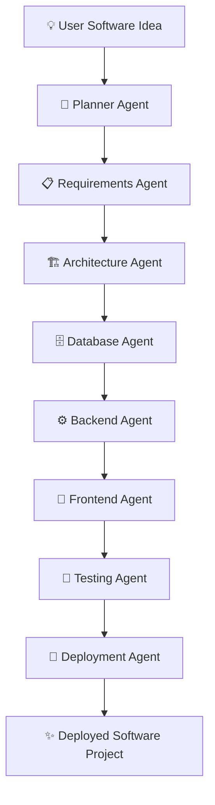
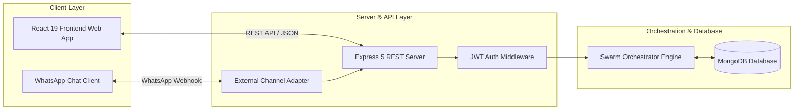

# SwarmOS

> **AI Agent Teams for Building Software from Ideas to Deployment.**

SwarmOS is an AI-powered multi-agent software development platform where specialized AI agents collaborate synchronously to transform natural-language software ideas into structured, full-stack software projects.

Instead of relying on a single general-purpose chatbot, SwarmOS models software engineering as a coordinated effort between specialized AI agents—spanning planning, architecture, backend API creation, frontend UI generation, database design, testing, and deployment.

---

## 💡 The Problem

Building modern software applications requires coordinating multiple disciplines:

- 📋 **Requirements Engineering** & Task Specs
- 🏗 **System Architecture** & Microservice Topology
- 🎨 **Frontend UI/UX Design**
- ⚙️ **Backend REST APIs** & Middleware
- 🗄 **Database Schemas** & Relational Models
- 🧪 **Quality Assurance**, Security & Vulnerability Scans
- 🚀 **Build & Cloud Deployment**

For students, beginners, startups, and small engineering teams, managing all these phases simultaneously can be overwhelming and time-consuming. Traditional AI coding assistants operate primarily as single-file conversational code generators. 

**SwarmOS explores a different paradigm**: An autonomous AI engineering swarm with specialized responsibilities collaborating on the same codebase.

---

## 🎯 Our Solution



Each agent handles a specific phase of the software development lifecycle. Users can monitor progress, inspect generated tasks, and steer the project interactively from the developer workspace or via mobile WhatsApp interaction.

---

## 🚀 What Makes SwarmOS Different?

### 1. AI Agent Team
Instead of one generic AI assistant attempting to do everything, SwarmOS dispatches specialized AI roles with domain-focused responsibilities.

### 2. Autonomous Agent Collaboration
Agents are organized around different software engineering stages and work together to build, update, and evolve the project.

### 3. Visual Agent Execution
Users maintain full visibility into agent statuses (*Waiting*, *Running*, *Completed*, *Failed*), current tasks, progress bars, and a real-time activity stream.

### 4. Conversational Development
Users can express change requests naturally (*e.g., "Add Excel export"*, *"Enable dark mode"*) rather than manually editing configuration files or writing boilerplate code.

### 5. WhatsApp Development Interface
Users can stay updated and manage their software projects on the go through a WhatsApp interface. *(Currently available in Demo/Mock Mode; production Meta WhatsApp Cloud API architecture built-in).*

---

## ✨ Features & Status Matrix

| Feature | Status | Description |
| :--- | :---: | :--- |
| **User Authentication** | ✅ Implemented | Secure JWT auth, BCrypt password hashing, and user profile management |
| **Project Management** | ✅ Implemented | Create, list, filter, update, and delete software projects |
| **AI Agent Swarm Workforce** | ✅ Implemented | 8 specialized AI agents collaborating on project execution |
| **Agent Execution Monitoring** | ✅ Implemented | Live agent progress, status pills, current task tracking |
| **3-Panel Developer Workspace** | ✅ Implemented | Fast 3-column workspace with quick loading & background updates |
| **Live Activity Stream Timeline** | ✅ Implemented | Real-time event log tracking agent actions and project milestones |
| **Conversational Command Engine** | ✅ Implemented | *"Talk to SwarmOS"* prompt box for submitting natural language change requests |
| **Interactive Task Kanban** | ✅ Implemented | Create, update task status, view details, and assign agents |
| **Interactive WhatsApp Simulator** | 🧪 Demo/Mock | Interactive phone chat simulator for hackathon demonstration |
| **WhatsApp Cloud API Integration** | 🚧 Architecture Ready | Production Webhook endpoints (`GET/POST`) for Meta WhatsApp Cloud API |
| **Responsive Developer SaaS UI** | ✅ Implemented | Modern dark-themed UI built with React, Tailwind CSS & Framer Motion |

---

## 🤖 AI Agent Team Roster

| Agent | Responsibility |
| :--- | :--- |
| 🧠 **Planner Agent** | Breaks natural language ideas into structured project plans & task breakdowns |
| 📋 **Requirements Agent** | Converts user prompts into technical user stories, acceptance criteria & specs |
| 🏗 **Architecture Agent** | Designs system architecture, microservice boundaries & component blueprints |
| 🗄 **Database Agent** | Architects MongoDB schemas, collection structures & indexes |
| ⚙️ **Backend Agent** | Generates Express RESTful APIs, controllers & authentication middleware |
| 🎨 **Frontend Agent** | Builds responsive React components using Tailwind CSS and Lucide icons |
| 🧪 **Testing Agent** | Performs unit testing, quality gate verification & vulnerability checks |
| 🚀 **Deployment Agent** | Prepares build configurations, Docker containerization & deployment artifacts |

*Note: Implementation depth for individual agent code generation cycles evolves continuously as project complexity scales.*

---

## 📱 SwarmOS Anywhere — WhatsApp Development

SwarmOS is designed with the vision that developers and project leads should not need to remain glued to their laptop dashboard to manage software builds.

### Conceptual Conversational Flow

```text
User: "Build an attendance management system for my college."
SwarmOS: "Got it! I've created your project and assigned the Planner Agent to map requirements."

[Later on mobile...]

User: "Add Excel export feature."
SwarmOS: "Change request received! Assigned task to Backend Agent and Frontend Agent."
```

### Integration Modes
- 🧪 **Demo / Mock Mode** *(Default)*: Runs locally without requiring external paid services or Meta API credentials. Perfect for offline hackathon demonstrations and interactive testing.
- 🚧 **Production Mode**: Connects directly to the **Meta WhatsApp Cloud API** via HTTPS Webhook verification (`GET /api/external-channels/whatsapp/webhook`).

---

## 🛠 Technology Stack

### Frontend
- **Framework**: React 19, TypeScript, Vite
- **Styling**: Tailwind CSS v4, Glassmorphism, CSS Gradients
- **Animations**: Framer Motion
- **Icons**: Lucide React
- **Routing**: React Router DOM v7

### Backend
- **Runtime**: Node.js, Express 5
- **Database ODM**: Mongoose v9
- **HTTP Client**: Axios
- **File Uploads**: Multer
- **Integrations**: Twilio SDK

### Database & Security
- **Database**: MongoDB (Local or MongoDB Atlas)
- **Authentication**: JSON Web Tokens (JWT), BCrypt.js
- **Security**: Environment variables, input validation, user-project isolation

---

## 📐 System Architecture



---

## 🔄 User Flow

1. **Visit SwarmOS**: Open the landing page at `http://localhost:5173/`.
2. **Create Account**: Register with Name, Email, Password, Phone Number, and WhatsApp permission consent.
3. **Login**: Authenticate and redirect automatically to the Dashboard.
4. **Create Project**: Click `+ New Project` and describe what you want to build (*e.g., "Build a college attendance management system"*).
5. **Team Assembly**: SwarmOS creates the project record and initializes the 8-agent team.
6. **Workspace Launch**: Enter the 3-panel developer workspace.
7. **Monitor Agents**: Watch agent statuses (*Running*, *Completed*) and real-time activity logs.
8. **Talk to SwarmOS**: Submit change requests (*e.g. "Add Excel export"*) via the command panel or quick chips.
9. **Task Allocation**: Orchestrator classifies intent, creates a task in MongoDB, and assigns relevant agents.
10. **WhatsApp Interaction**: Navigate to `/whatsapp` to simulate or test mobile WhatsApp commands.

---

## 🖥️ Product Screens

*(Add screenshot images to `docs/screenshots/` to display visually)*

- 📍 **Landing Page**: `docs/screenshots/landing.png`
- 📍 **Authentication**: `docs/screenshots/login.png`
- 📍 **Dashboard**: `docs/screenshots/dashboard.png`
- 📍 **Project Workspace**: `docs/screenshots/workspace.png`
- 📍 **WhatsApp Control**: `docs/screenshots/whatsapp.png`

---

## 🚀 Local Setup Instructions

### Prerequisites
- **Node.js**: v18+ installed
- **MongoDB**: Local MongoDB instance running on `mongodb://127.0.0.1:27017/swarmos` or a MongoDB Atlas URI.

### 1. Clone Repository
```bash
git clone https://github.com/Pooja-1109/SwarmOS-.git
cd SwarmOS-
```

### 2. Backend Setup
```bash
cd backend
npm install
npm run dev
```
*Backend server will start on `http://localhost:5000`.*

### 3. Frontend Setup
Open a new terminal window:
```bash
cd frontend
npm install
npm run dev
```
*Frontend application will run on `http://localhost:5173`.*

---

## 🔐 Environment Variables

Create `.env` inside `backend/`:

```env
PORT=5000
MONGO_URI=mongodb://127.0.0.1:27017/swarmos
JWT_SECRET=your_jwt_secret_key_here

# WhatsApp Configuration
WHATSAPP_MODE=mock
WHATSAPP_ACCESS_TOKEN=your_meta_access_token
WHATSAPP_PHONE_NUMBER_ID=your_phone_number_id
WHATSAPP_BUSINESS_ACCOUNT_ID=your_business_account_id
WHATSAPP_VERIFY_TOKEN=swarmos_verify_token
```

> [!NOTE]
> Real WhatsApp credentials are only required when setting `WHATSAPP_MODE=real`. In `WHATSAPP_MODE=mock`, SwarmOS runs completely self-contained.

---

## 🎬 Hackathon Demo Mode

For hackathon judges and evaluators, SwarmOS includes a built-in **Hackathon Demo Mode**:
- **Offline Reliability**: The platform operates without requiring external paid API keys or active WhatsApp Business accounts.
- **Interactive Simulator**: The `/whatsapp` page includes an interactive WhatsApp phone UI simulator that dispatches real commands to the backend orchestrator and demonstrates live agent status updates.

---

## 🏆 Why SwarmOS? (Hackathon Value)

- 💡 **Innovation**: Combines multi-agent software engineering swarms with mobile conversational control.
- 🎯 **Practicality**: Simplifies the complex multi-step process of going from idea to software structure.
- ⚡ **Performance**: Built with fast-loading workspace shells, background fetching, and zero-latency UI interactions.
- 🔌 **Extensibility**: Modular agent architecture allows plugging in additional specialized AI agents (*e.g., Security, DevOps, RAG*).
- 🤝 **Human-AI Partnership**: Developers remain in total control while AI agents execute heavy lifting.

---

## 🛣️ Roadmap

- [x] ✅ **Multi-Agent Swarm Workforce (8 Specialized Roles)**
- [x] ✅ **3-Panel Developer Workspace with Fast Loading Shell**
- [x] ✅ **Conversational Project Commands & Intent Classifier**
- [x] ✅ **Demo/Mock WhatsApp Interactive Control Center**
- [x] ✅ **Meta WhatsApp Cloud API Production Webhook Architecture**
- [ ] 🚧 **Automated End-to-End Code Sandbox Execution**
- [ ] 🔮 **One-Click Cloud Deployment (Vercel / Render / GCP)**
- [ ] 🔮 **Voice-Based Project Commands**
- [ ] 🔮 **Multi-Developer Real-Time Collaboration**

---

## 📄 License

This project is licensed under the **ISC License** - see the `backend/package.json` file for details.
